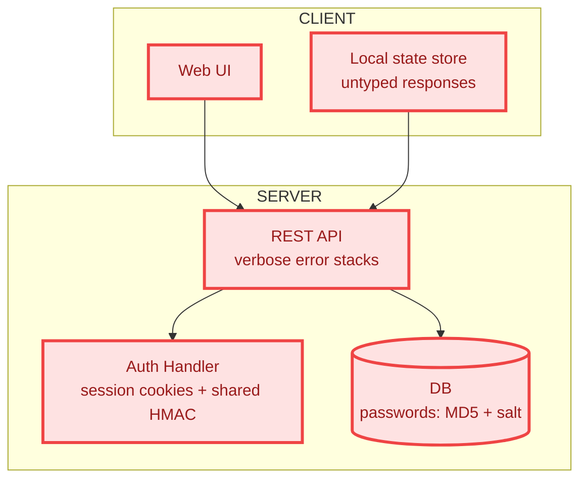
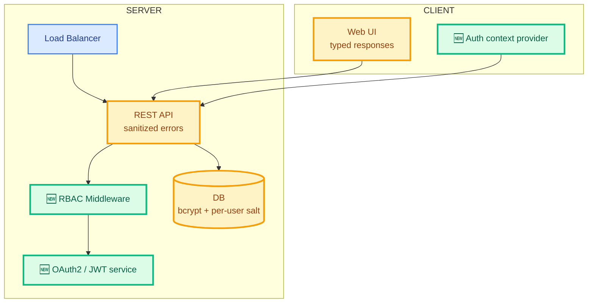

# Visual Code Review

Render a comprehensive PR/MR review on a Miro board: BEFORE/AFTER architecture diagrams, an OWASP threats table (sourced from the `security-review` skill), a files-changed table, and a Summary of Changes document — all on a single large frame. After the artifacts are created, link them back from the PR/MR description so reviewers can find them without leaving their forge.

The skill is platform-agnostic: it detects the forge (GitHub, GitLab, other) from the URL or the configured git remote and uses whichever CLI is available locally. It's also **client-server aware** — when the repo has both a client and a server, the skill tags every change and call-out by where it lives, and the BEFORE/AFTER diagrams render the two halves as distinct subgraphs so contract changes are immediately visible.

The user provides one source: a PR/MR number, `owner/repo#number` (or `group/project!number`), a full PR/MR URL, the keyword "local changes", or a branch name to compare against the default branch.

## Workflow

### 1. Identify the source from the user's request

Determine the source type and infer the platform from the URL or configured git remote:

- A bare number → PR/MR in the current repo (infer the platform from the configured git remote: `git remote get-url origin`)
- `owner/repo#number` (or `group/project!number` for GitLab-style) → PR/MR in an external repo on the same platform as the current remote, unless a host is given
- A full URL → extract host, owner/group, repo/project, and PR/MR number from the URL; the host determines the platform
- "local changes" / uncommitted work → local diff only, no PR
- A branch name → local diff against the default branch (`main` or whatever the remote shows as default)

#### Tool selection

Pick the CLI based on what's installed and what the source points at. Do not assume `gh`. Run `command -v <cli>` to check availability before invoking:

- GitHub URLs / `github.com` remote → `gh` CLI if available
- GitLab URLs / `gitlab.com` or self-hosted GitLab → `glab` CLI if available
- If no first-party CLI is available, fall back to authenticated REST via `curl` using whatever credentials the user already has configured (e.g. `~/.netrc`, env var tokens like `$GITHUB_TOKEN`, `$GITLAB_TOKEN`)
- For local / branch-comparison sources, plain `git` is sufficient — no platform CLI needed

State the detected platform and tool in chat before proceeding.

### 2. Extract changes

Fetch four things, regardless of platform:

1. **PR title** — used as the board name in §7
2. **Metadata**: description/body, author, changed files with additions/deletions per file
3. **Unified diff** of the change
4. **Head and base SHAs** — for link anchors

**GitHub example (`gh`):**
```bash
PR_TITLE=$(gh pr view $PR_NUMBER --json title -q .title)
gh pr view $PR_NUMBER --json body,author,files,additions,deletions
gh pr diff $PR_NUMBER
LINK_SHA=$(gh pr view $PR_NUMBER --json headRefOid -q .headRefOid)
LINK_BASE_SHA=$(gh pr view $PR_NUMBER --json baseRefOid -q .baseRefOid)
```

**GitLab example (`glab`):**
```bash
PR_TITLE=$(glab mr view $MR_NUMBER -F json | jq -r .title)
glab mr view $MR_NUMBER -F json
glab mr diff $MR_NUMBER
LINK_SHA=$(glab mr view $MR_NUMBER -F json | jq -r '.diff_refs.head_sha // .sha')
LINK_BASE_SHA=$(glab mr view $MR_NUMBER -F json | jq -r '.diff_refs.base_sha // .target_branch')
```

**REST fallback:** authenticated `curl` to the platform's REST endpoint; read `head.sha` / `base.sha` (GitHub) or `diff_refs.head_sha` / `diff_refs.base_sha` (GitLab) from the same payload.

**Local changes / branch comparison** (no PR_TITLE available — synthesize one):
```bash
git status --porcelain
git diff HEAD
DEFAULT_BRANCH=$(git symbolic-ref refs/remotes/origin/HEAD | sed 's@^refs/remotes/origin/@@')
git log $DEFAULT_BRANCH..HEAD --oneline   # for branch comparison
git diff $DEFAULT_BRANCH...HEAD
LINK_SHA=$(git rev-parse HEAD)
LINK_BASE_SHA=$(git merge-base origin/$DEFAULT_BRANCH HEAD 2>/dev/null || git rev-parse HEAD)
# Synthesized title
PR_TITLE="Local changes — $(basename $(pwd))"    # for local
PR_TITLE="Branch $(git branch --show-current) → $DEFAULT_BRANCH"   # for branch comparison
```

#### Source-link template

Capture once and reuse for every file reference in §9:

- `LINK_HOST` / `LINK_OWNER` / `LINK_REPO` (or `LINK_GROUP` / `LINK_PROJECT` for GitLab)
- `LINK_TEMPLATE`:
  - GitHub: `https://{host}/{owner}/{repo}/blob/{sha}/{path}` (anchor `#L{a}-L{b}`)
  - GitLab: `https://{host}/{group}/{project}/-/blob/{sha}/{path}` (anchor `#L{a}-{b}`)
- **No-remote sources** (`local changes`, branch with no pushed remote): set `LINK_TEMPLATE=""` and announce once: `"No remote URL available — file references shown as plain paths."`

### 3. Detect client-server topology

Many real PRs touch both halves of a client-server system. Identify which halves exist in this repo and which the PR touches.

**Signals for a client / frontend:**
- `package.json` with `react`, `vue`, `svelte`, `next`, `vite`, `webpack`, browser-only deps
- Directories: `web/`, `client/`, `frontend/`, `apps/web`, `src/components/`
- Build outputs: `dist/`, `build/`, `public/`

**Signals for a server / backend:**
- `package.json` with `express`, `fastify`, `nest`, `koa`; `pyproject.toml`; `go.mod`; `Cargo.toml`
- Directories: `server/`, `api/`, `backend/`, `apps/api`, `src/controllers/`, `src/routes/`
- DB migrations, `Dockerfile` exposing a port, `Procfile` with `web:` workers

**For each changed file**, tag it:
- `client` — frontend code
- `server` — backend code
- `shared` — schema/contract files, generated types, shared packages
- `infra` — Dockerfiles, k8s, CI, IaC
- `docs` — markdown, RFCs

Build a topology summary used in §9:
- `CLIENT_PRESENT` / `SERVER_PRESENT` — booleans
- `CONTRACT_CHANGES` — list of files in `shared/` or OpenAPI specs, GraphQL schemas, gRPC `.proto`, REST handler signature changes
- `CLIENT_FILES_COUNT` / `SERVER_FILES_COUNT` / `SHARED_FILES_COUNT`

If both client and server are present in the repo but **only one half is touched** by this PR, note it: `"Server-only change — no client modifications."` Reviewers should know whether to worry about the other half.

### 4. Analyze changes

For each changed file, determine:

**Basic Analysis:**
- **Status**: Added, Modified, or Deleted
- **Side**: Client / Server / Shared / Infra / Docs (from §3)
- **Change Summary**: combine "what changed" with "why it matters"
- **Risk Level** (§5)

**Architecture Analysis:**
- New components or modules introduced (note the side)
- Dependency changes (new imports, package updates)
- **Contract changes** — anything that crosses the client-server boundary (API shape, event payloads, shared types)
- Pattern changes (design patterns introduced or violated)
- Breaking changes requiring consumer updates

**Client-server specific call-outs:**
- A server change that alters response shape without a matching client change → flag as a potential contract break
- A client change that calls a new endpoint that doesn't exist in the server diff → flag as a missing server-side change
- Schema migrations without rollback paths → flag as deployment risk

### 5. Risk Assessment

| Risk Level | Criteria |
|------------|----------|
| **High** | Security-sensitive, auth/authz, database migrations, core business logic, breaking API/contract changes, cryptography |
| **Medium** | API changes (non-breaking), configuration, shared utilities, new dependencies, data model changes |
| **Low** | Tests, documentation, styling, localization, internal refactoring |

### 6. Security analysis via the `security-review` skill

Invoke the **`security-review`** skill (built into the harness) to do a structured security pass against the changes on the branch. Capture its output and convert it to OWASP-Top-10 rows for the table in §9.

The expected per-finding shape after normalization:

```
{
  "owasp_id": "A01:2021" | "A02:2021" | ... | "A10:2021",
  "threat": "<OWASP category name>",
  "where_it_lived": "<short location, e.g. file or pre-PR pattern>",
  "mitigation": "<what this PR does about it>",
  "severity": "High" | "Medium" | "Low"
}
```

If the security-review skill is unavailable or returns no findings, do a lightweight OWASP walk yourself: for each of A01–A10, decide whether the diff is relevant; if yes, write a one-line row; if no, skip. Don't fabricate findings — an empty OWASP table is fine for PRs with no security surface and is preferable to padding.

When the diff explicitly *fixes* a vulnerability (e.g. replaces MD5+salt with bcrypt), record the row even though the threat no longer exists post-merge — the **Where it lived** column captures pre-PR state, **Mitigation in this PR** captures the fix. The table then doubles as a "this PR closes these threats" record, which is exactly what reviewers want to see.

### 7. Triage: decide whether the board is worth creating

The default is **yes, create the board** — that's what the user invoked the skill for. Only bail out when **all** of the following hold and produce a no-board chat-only response:

- ≤ 2 files changed, AND
- < 20 lines changed (additions + deletions combined), AND
- No file marked **High** risk in §5, AND
- No security-sensitive paths touched (auth, crypto, config, migrations), AND
- No contract changes (§3)

In that case the entire output is a single chat message:

> PR is trivial (N files, ±M lines, no high-risk areas, no contract changes). Skipping Miro visualization — a board would not add review value. PR/MR description was not modified.

Otherwise proceed to §8. The single-frame template is sized to absorb large PRs as well as medium ones — you don't need to scale frames; you scale the content inside the tables and the granularity of the diagrams.

### 8. Create the Miro board

**Always create a fresh board** with the Miro MCP `board_create` tool. Set the board name to the PR title captured in §2:

- For a PR/MR source: name = `<PR_TITLE>` exactly (truncate to ~150 chars if Miro rejects longer values)
- For local changes / branch comparison: name = the synthesized title from §2

Capture the resulting URL as `BOARD_URL` and announce in chat:

> Created Miro board: <BOARD_URL>

### 9. Compose the board

The board uses a **single large frame** with a fixed slot layout — modeled on the reference template. Don't invent a different layout; this one is consistent across runs so reviewers always know where to look.

#### 9a. Color palette (use everywhere)

These hex codes are shared by every diagram and every fixed-set column on the board. Keep them consistent so a reviewer who learns the palette on one diagram can read every other artifact at a glance.

| Semantic | Fill | Stroke | Text | Mermaid classDef name |
|---|---|---|---|---|
| **Added / new** | `#DCFCE7` | `#10B981` | `#065F46` | `new` |
| **Modified** | `#FEF3C7` | `#F59E0B` | `#92400E` | `modified` |
| **Removed / vulnerable** | `#FEE2E2` | `#EF4444` | `#991B1B` | `removed` |
| **Unchanged** | `#DBEAFE` | `#3B82F6` | `#1E3A8A` | `unchanged` |

For fixed-set table columns (`Impact`, `Severity`):
- `High` → stroke `#EF4444`
- `Medium` → stroke `#F59E0B`
- `Low` → stroke `#10B981`

When the BEFORE diagram represents a pre-PR vulnerable state, use the **removed** palette for the entire diagram (signals "this is what we're getting rid of"). When AFTER represents the post-PR state, mark every node by its delta:

- New components → `new`
- Modified components → `modified`
- Unchanged components carried over → `unchanged`
- Anything that was deleted in this PR but shown for context → `removed`

#### 9b. DSL prerequisites (call once per run, before any creation)

Two Miro MCP tools expose the canonical DSL specifications used by the creation tools. The Miro MCP server documents `diagram_get_dsl` as **REQUIRED** before any `diagram_create_*` call — fetch it once per diagram type and reuse the returned spec across every diagram of that type in the run.

| Call | When | Purpose |
|---|---|---|
| `layout_get_dsl(miro_url=BOARD_URL)` | Before §9c (Create the frame) | Returns the layout DSL the board accepts — frame metadata, child placement, supported node shapes |
| `diagram_get_dsl(diagram_type='flowchart')` | Before §9d (BEFORE) and §9e (AFTER) | Returns flowchart DSL syntax, color guidelines, and worked examples used by `diagram_create_mermaid` |
| `diagram_get_dsl(diagram_type='uml_sequence')` | Only if §9j adds sequence diagrams | Returns UML sequence DSL |
| `diagram_get_dsl(diagram_type='uml_class')` | Only if §9j adds class diagrams | Returns UML class DSL |
| `diagram_get_dsl(diagram_type='entity_relationship')` | Only if §9j adds ER diagrams | Returns ER DSL |

Cache the returned specs in conversation memory for the duration of the run. Don't re-fetch the same type more than once. Announce the cache once in chat so the user can see what was loaded:

> Loaded DSL specs: layout (board <BOARD_ID>), diagram[flowchart]<, …>

**Palette precedence.** The returned diagram DSL may suggest its own color conventions. **Override them with our codified palette from §9a** — the four `classDef` blocks (`new`, `modified`, `removed`, `unchanged`) and the three table fixed-set colors are non-negotiable for cross-PR consistency. Keep everything else from the returned DSL (node shape syntax, edge styles, subgraph rules, escape sequences for labels with `<br/>` / quotes / emoji) as-is — that's what makes the Mermaid render cleanly on Miro.

**If a DSL call fails** (server transient, schema not available): retry once; if it still fails, fall back to the conventional Mermaid syntax shown in §9d / §9e and note in chat: `"Could not fetch <diagram_type> DSL — falling back to conventional Mermaid. Rendering may differ from the canonical Miro spec."`

#### 9c. Create the frame

Use `layout_create` (with the layout DSL fetched in §9b) to make a single large frame at `(0, 0)`, titled `PR Review — <PR_TITLE>` (truncate the title if it makes the frame caption unreadable). The frame must be large enough to hold everything below at a readable scale — generously sized; reviewers can zoom.

#### 9d. BEFORE diagram (top-left of frame)

`diagram_create_mermaid` — a Mermaid `flowchart TB` showing the **pre-PR architecture** of the area this PR touches. Scope:

- For client-only PRs: just the client and its dependencies
- For server-only PRs: just the server and its dependencies
- For full-stack PRs: both halves as **subgraphs** (`subgraph CLIENT` / `subgraph SERVER`) with edges across them — the contract surface is the most important thing to see

Every node carries a `classDef` that maps to the palette above. Always include the classDef block at the bottom of the diagram.

Example skeleton for a full-stack BEFORE diagram:



#### 9e. AFTER diagram (top-right of frame)

`diagram_create_mermaid` — same shape and conventions as BEFORE, but rendered with **per-node** delta marking using the full palette. Always include all four classDef blocks at the bottom so the rendering is self-contained:



Prefix node labels with `🆕` for new and `❌` for removed when emoji renders cleanly — the prefixes survive even if classDef is dropped by a renderer.

#### 9f. OWASP Threats table (middle of frame)

`table_create` with these columns, in this order:

| Column | Type | Notes |
|---|---|---|
| OWASP ID | text | `A01:2021` … `A10:2021` |
| Threat | text | OWASP category name |
| Where it lived | text | Pre-PR location or pattern (file path when known) |
| Mitigation in this PR | text | What this PR does about it |
| Severity | select (fixed-set) | High / Medium / Low — color-coded with the palette stroke colors |

One row per finding from §6. Order rows by severity descending (High first). If §6 returned no findings, still create the table with a single row reading `Threat: none identified in scope, Severity: Low` — the table's presence reassures the reviewer that the security pass happened.

#### 9g. Files Changed table (below OWASP table)

`table_create` with these columns, in this order:

| Column | Type | Notes |
|---|---|---|
| Δ | text | `+<additions> / −<deletions>` |
| Impact | select (fixed-set) | High / Medium / Low — same palette colors |
| File | text | Clickable URL when `LINK_TEMPLATE` is set; plain path otherwise |

One row per changed file. Order rows by impact descending, then by additions+deletions descending within an impact tier. For very large PRs (30+ files), keep the single table — sorting handles the noise, and splitting into two tables is harder to scan than scrolling one.

#### 9h. Summary of Changes document (right side of frame)

`doc_create` with this template. Skip any section that's empty rather than padding.

```markdown
# Summary of Changes

<2–3 sentences describing the overall intent of the PR, derived from the PR title + body + the analysis in §4>

## 🔐 Authentication & Authorization
- <bullet list of auth/authz changes, or omit the section if none>

## 🌐 Client changes
- <client-side bullets — components, state, routing, contract consumption>

## 🛰️ Server changes
- <server-side bullets — routes, handlers, middleware, services>

## 🤝 Contract changes
- <bullets describing changes that cross the client-server boundary: API shape, schema, events. Critical to call out.>

## 🔑 Cryptography & Secrets
- <bullets if applicable, else omit>

## 🧪 Testing
- <test additions / coverage notes>

## 🗄️ Data & Migrations
- <DB schema, migration files, rollback notes>

## ⚠️ Migration / Rollout
- <feature flags, phased rollout, breaking-change coordination notes>

## ✅ Ready-to-merge checklist
- [ ] CI passing
- [ ] Security review complete
- [ ] Contract changes documented (if applicable)
- [ ] Migration runbook written (if applicable)
- [ ] Sign-off from <reviewers>
```

The section headings use leading emoji to mirror the reference template — the emoji are visual landmarks for scanning, not decoration. Skip a section entirely (heading and bullets) when it has nothing to say.

#### 9i. Layout

Use the reference template's positions as a guide:

```
┌─────────────────────────────────────────────────────────────┐
│  Frame: "PR Review — <PR title>"                            │
│                                                             │
│  ┌───────────┐                            ┌───────────┐     │
│  │  BEFORE   │                            │   AFTER   │     │
│  │  diagram  │                            │  diagram  │     │
│  └───────────┘                            └───────────┘     │
│                                                             │
│           ┌──────────────────────────┐                      │
│           │   OWASP Threats table    │                      │
│           └──────────────────────────┘                      │
│                                                             │
│           ┌──────────────────────────┐  ┌───────────────┐   │
│           │  Files Changed table     │  │  Summary of   │   │
│           │                          │  │  Changes doc  │   │
│           └──────────────────────────┘  └───────────────┘   │
└─────────────────────────────────────────────────────────────┘
```

The exact pixel positions don't matter — Miro's layout tools handle that — but the relative arrangement (diagrams top, tables middle, doc right) does. Reviewers learn the layout once and reuse it across runs.

#### 9j. Optional extras (only when the user asks)

The base template above is what every run produces. If the user explicitly asks for extras, add them inside the same frame (do not introduce more frames):

- **Per-flow sequence diagrams** for complex contract changes
- **Code widgets** (`code_widget_create`) for High-impact snippets the reviewer needs to see verbatim
- **Per-subsystem documents** for very large PRs

Don't add these by default. Stick to the template unless asked.

### 10. Post link back to PR/MR

Once the artifacts are created, surface the link from the PR/MR itself so reviewers see it without leaving their forge.

**Skip this step** when:
- The source is "local changes"
- The source is a branch with no associated open PR/MR

In those cases the link is reported only in chat (see §Output).

#### Block format

Append a delimited block to the existing PR/MR description. Reuse the same delimiters on every run so the block can be replaced cleanly:

```
<!-- miro-pr-docs:start -->
## PR documentation

PR review on Miro: <BOARD_URL>

- BEFORE/AFTER architecture diagrams
- OWASP threats analyzed: <count> (High: <h>, Medium: <m>, Low: <l>)
- Files changed: <count> (High-impact: <h>)
- Client-server touch: <client-only | server-only | both | n/a>
<!-- miro-pr-docs:end -->
```

**Idempotency:**
- If the description already contains the `<!-- miro-pr-docs:start -->` … `<!-- miro-pr-docs:end -->` markers, replace the contents in place
- Otherwise append the block at the end of the existing description, preserving everything else verbatim
- Never overwrite the user-authored portion of the description

#### Update the description

Use the same CLI selection from §1. Read the current body, splice the new block, write it back.

**GitHub example (`gh`):**
```bash
BODY=$(gh pr view $PR_NUMBER --json body -q .body)
# (splice: replace existing block or append) → $NEW_BODY
gh pr edit $PR_NUMBER --body "$NEW_BODY"
```

**GitLab example (`glab`):**
```bash
BODY=$(glab mr view $MR_NUMBER -F json | jq -r .description)
# (splice) → $NEW_BODY
glab mr update $MR_NUMBER --description "$NEW_BODY"
```

**REST fallback:** read and PATCH the PR/MR body via the platform's REST API.

#### Permission failure fallback

If editing the description fails (e.g. reviewing someone else's PR without permission), post the same block as a single PR/MR comment instead. Mention this fallback in chat so the user knows the description wasn't changed.

## Output

If the §7 bail-out applied, the entire output is the trivial-PR chat message — no board, no description update.

Otherwise, after completion provide in chat:

1. `BOARD_URL` (with `moveToWidget=<frame_id>` if available)
2. Confirmation that the PR/MR description was updated (or that a comment was posted as fallback, or that the post step was skipped for local/branchless sources)
3. Composition summary: BEFORE/AFTER diagrams created, `<N>` OWASP rows, `<M>` files-changed rows, Summary doc sections present
4. Client-server touch summary: `client-only | server-only | both | n/a`, with notable contract changes called out
5. High-impact files requiring careful review
6. Top security findings (High severity only)
7. Base revision `<short LINK_BASE_SHA>` and head revision `<short LINK_SHA>` (chat-only — never on the board)

## Background

### Why a single frame

A single frame keeps the review at one zoom level — a reviewer pans through the same layout every time. Multi-frame layouts (one per concern) force the reviewer to navigate the board itself, which is itself a small cognitive tax. For PR review the layout should be invisible; the content should not.

### Why the fixed color palette

Color is the cheapest carrier of "what changed" on a diagram. By using the same four-color palette across every BEFORE/AFTER pair and every table's Impact/Severity column, a reviewer who learns the palette on one PR can read every subsequent PR's board at a glance. Don't substitute palette colors with theme colors or per-PR aesthetics — consistency is the value.

### Why always create a fresh board

Every PR gets its own board, named after the PR title. This makes a board's identity match the PR's identity: searchable by title in Miro, linkable from the PR description, archivable along with the PR after merge. Re-using a board across PRs erodes that mapping.

### Client-server awareness

For repos that contain both client and server, the skill always emits BEFORE/AFTER diagrams with `subgraph CLIENT` / `subgraph SERVER` blocks — even when the PR only touches one side. The unchanged side is rendered in the `unchanged` palette as visual context. Contract changes are then visible as the edges that cross the subgraph boundary, marked with the `new` or `modified` palette. Reviewers can see at a glance whether the PR affects the contract, regardless of where the code lives.

### Tool reference

| Tool | Used for |
|---|---|
| `board_create` | Always; board name = PR title |
| `layout_get_dsl` | **REQUIRED before `layout_create`** — fetch the layout DSL once per run |
| `layout_create` | The single review frame |
| `diagram_get_dsl` | **REQUIRED before `diagram_create_mermaid`** — fetch once per diagram type (`flowchart` always; `uml_sequence` / `uml_class` / `entity_relationship` only for optional extras in §9j) |
| `diagram_create_mermaid` | BEFORE / AFTER architecture diagrams (and any extras) |
| `table_create` | OWASP Threats table, Files Changed table |
| `doc_create` | Summary of Changes document |
| `code_widget_create` | Optional code snippets (only when asked) |
| `board_list_items` | Re-read item IDs / positions if reflow is needed |

### References

See `references/risk-assessment.md` for detailed scoring criteria and `references/review-patterns.md` for review patterns.
