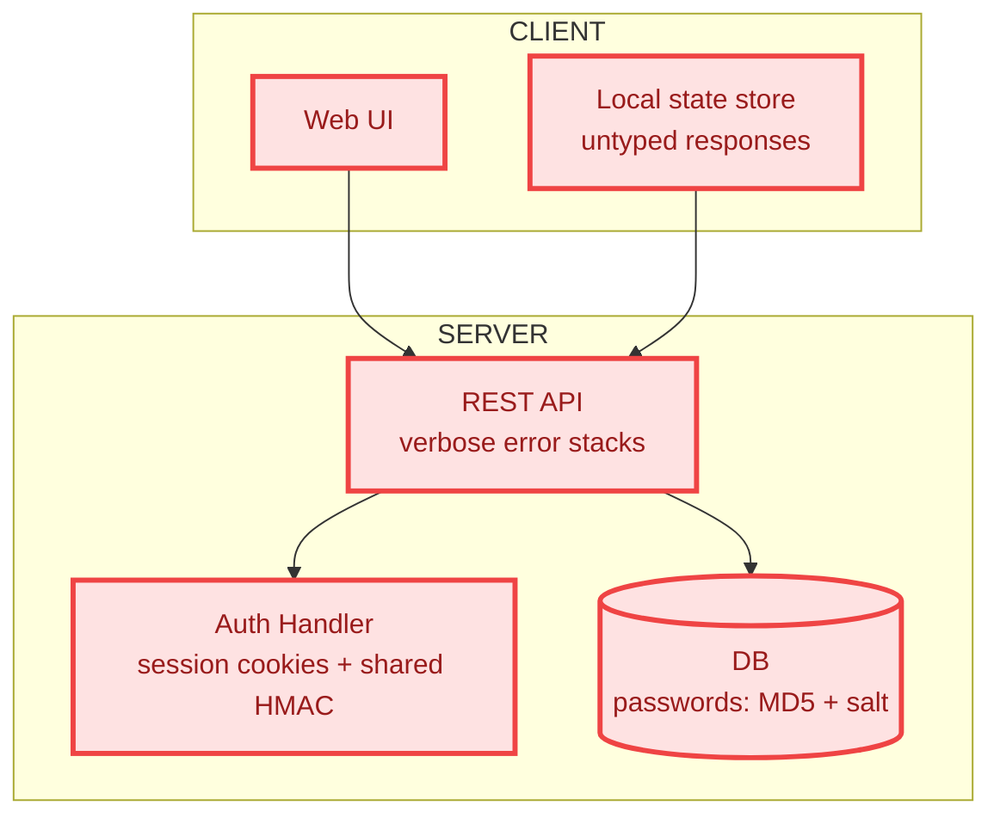
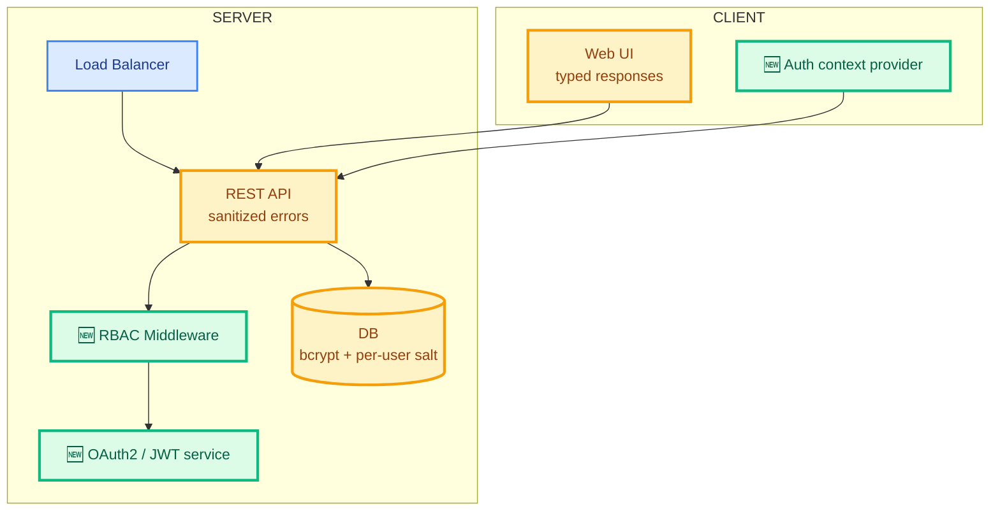

# Visualize PR on Miro

Render a **presentation-quality** PR/MR visualization on a Miro board. The output is a single large frame that reads top-to-bottom like a slide:

1. **Header banner** — PR title, author, branch, files, topic-tag chips
2. **Architecture — Before & After** — titled section with BEFORE/AFTER pill labels above each diagram and a color legend below
3. **OWASP Top 10 — Threats Addressed** — titled section with the threats table
4. **Change Summary** — titled section with the files-changed table and a Summary-of-Changes document side by side

The skill is platform-agnostic (GitHub, GitLab, other) and **client-server aware** — when the repo has both halves, the BEFORE/AFTER diagrams render them as distinct subgraphs.

> **This skill is the visual-polish sibling of `miro-code-review`.** The analysis pipeline is the same; the difference is the **board composition** — every artifact gets a titled section band, every diagram gets a labeled pill, and the board name is **exactly the PR title** with no prefix or suffix. Reach for this skill when the board is going to be shared with non-engineers, posted in a launch doc, or screenshotted into a slide. Reach for `miro-code-review` when the board is a working tool for engineers reviewing a diff.

The user provides one source: a PR/MR number, `owner/repo#number` (or `group/project!number`), a full PR/MR URL, the keyword "local changes", or a branch name to compare against the default branch.

## Workflow

### 1. Identify the source from the user's request

Determine the source type and infer the platform from the URL or configured git remote:

- A bare number → PR/MR in the current repo (infer the platform from `git remote get-url origin`)
- `owner/repo#number` (or `group/project!number`) → PR/MR in an external repo on the same platform as the current remote, unless a host is given
- A full URL → extract host, owner/group, repo/project, and PR/MR number from the URL; the host determines the platform
- "local changes" / uncommitted work → local diff only, no PR
- A branch name → local diff against the default branch (`main` or whatever the remote shows as default)

#### Tool selection

Pick the CLI based on what's installed and what the source points at. Run `command -v <cli>` to check availability before invoking:

- GitHub URLs / `github.com` remote → `gh` CLI if available
- GitLab URLs / `gitlab.com` or self-hosted GitLab → `glab` CLI if available
- If no first-party CLI is available, fall back to authenticated REST via `curl` using whatever credentials the user has configured (`~/.netrc`, `$GITHUB_TOKEN`, `$GITLAB_TOKEN`)
- For local / branch-comparison sources, plain `git` is sufficient — no platform CLI needed

State the detected platform and tool in chat before proceeding.

### 2. Extract changes

Fetch six things, regardless of platform. The new items (vs. `miro-code-review`) are **PR number**, **labels**, and **branch names** — the polished header banner needs them.

1. **PR title** → `PR_TITLE` (used verbatim as the board name in §8 — do **not** add prefix, suffix, or repo name)
2. **PR number** → `PR_NUMBER`
3. **Metadata**: description/body, author login, head/base branch names, changed files with additions/deletions per file, labels
4. **Unified diff** of the change
5. **Head and base SHAs** — for link anchors (`LINK_SHA`, `LINK_BASE_SHA`)
6. **File counts and line totals** — used by the header banner (`<N> files · +<add> / −<del>`)

**GitHub example (`gh`):**
```bash
PR_TITLE=$(gh pr view $PR_NUMBER --json title -q .title)
PR_META=$(gh pr view $PR_NUMBER --json number,body,author,headRefName,baseRefName,labels,additions,deletions,changedFiles,files,headRefOid,baseRefOid)
gh pr diff $PR_NUMBER
LINK_SHA=$(echo "$PR_META" | jq -r .headRefOid)
LINK_BASE_SHA=$(echo "$PR_META" | jq -r .baseRefOid)
PR_AUTHOR=$(echo "$PR_META" | jq -r .author.login)
HEAD_BRANCH=$(echo "$PR_META" | jq -r .headRefName)
BASE_BRANCH=$(echo "$PR_META" | jq -r .baseRefName)
LABELS_JSON=$(echo "$PR_META" | jq -r '[.labels[].name] | join(", ")')
FILES_COUNT=$(echo "$PR_META" | jq -r .changedFiles)
ADDITIONS=$(echo "$PR_META" | jq -r .additions)
DELETIONS=$(echo "$PR_META" | jq -r .deletions)
```

**GitLab example (`glab`):**
```bash
MR_JSON=$(glab mr view $MR_NUMBER -F json)
PR_TITLE=$(echo "$MR_JSON" | jq -r .title)
PR_NUMBER=$(echo "$MR_JSON" | jq -r .iid)
PR_AUTHOR=$(echo "$MR_JSON" | jq -r .author.username)
HEAD_BRANCH=$(echo "$MR_JSON" | jq -r .source_branch)
BASE_BRANCH=$(echo "$MR_JSON" | jq -r .target_branch)
LABELS_JSON=$(echo "$MR_JSON" | jq -r '.labels // [] | join(", ")')
LINK_SHA=$(echo "$MR_JSON" | jq -r '.diff_refs.head_sha // .sha')
LINK_BASE_SHA=$(echo "$MR_JSON" | jq -r '.diff_refs.base_sha // .target_branch')
glab mr diff $MR_NUMBER
```

**Local changes / branch comparison** (no PR number — synthesize the header):
```bash
git status --porcelain
git diff HEAD
DEFAULT_BRANCH=$(git symbolic-ref refs/remotes/origin/HEAD | sed 's@^refs/remotes/origin/@@')
git log $DEFAULT_BRANCH..HEAD --oneline
git diff $DEFAULT_BRANCH...HEAD
LINK_SHA=$(git rev-parse HEAD)
LINK_BASE_SHA=$(git merge-base origin/$DEFAULT_BRANCH HEAD 2>/dev/null || git rev-parse HEAD)
# Synthesized title — used verbatim as board name
PR_TITLE="Local changes — $(basename $(pwd))"
# or for branch comparison:
PR_TITLE="Branch $(git branch --show-current) → $DEFAULT_BRANCH"
PR_NUMBER=""        # leave empty; header banner will hide the "#N" pill
PR_AUTHOR="$(git config user.name)"
HEAD_BRANCH="$(git branch --show-current)"
BASE_BRANCH="$DEFAULT_BRANCH"
LABELS_JSON=""
```

#### Source-link template

Capture once and reuse for every file reference in §9g:

- `LINK_HOST` / `LINK_OWNER` / `LINK_REPO` (or `LINK_GROUP` / `LINK_PROJECT` for GitLab)
- `LINK_TEMPLATE`:
  - GitHub: `https://{host}/{owner}/{repo}/blob/{sha}/{path}` (anchor `#L{a}-L{b}`)
  - GitLab: `https://{host}/{group}/{project}/-/blob/{sha}/{path}` (anchor `#L{a}-{b}`)
- **No-remote sources** (`local changes`, branch with no pushed remote): set `LINK_TEMPLATE=""` and announce once: `"No remote URL available — file references shown as plain paths."`

### 3. Detect client-server topology

Same as `miro-code-review` §3 — identify which halves of a client-server system the repo contains and which the PR touches.

**Signals for a client / frontend:** `package.json` with `react`, `vue`, `svelte`, `next`, `vite`; directories `web/`, `client/`, `frontend/`, `apps/web`; build outputs `dist/`, `build/`, `public/`.

**Signals for a server / backend:** `package.json` with `express`, `fastify`, `nest`; `pyproject.toml`; `go.mod`; `Cargo.toml`; directories `server/`, `api/`, `backend/`, `apps/api`; DB migrations; `Dockerfile` exposing a port.

**Tag every changed file** as `client` / `server` / `shared` / `infra` / `docs`.

Build a topology summary used in §9:
- `CLIENT_PRESENT` / `SERVER_PRESENT` — booleans
- `CONTRACT_CHANGES` — files in `shared/`, OpenAPI specs, GraphQL schemas, gRPC `.proto`, REST handler signature changes
- `CLIENT_FILES_COUNT` / `SERVER_FILES_COUNT` / `SHARED_FILES_COUNT`

If both halves exist but only one is touched, note it: `"Server-only change — no client modifications."`

### 4. Analyze changes

For each changed file determine **status** (Added / Modified / Deleted), **side** (Client / Server / Shared / Infra / Docs), **change summary** (what + why), and **risk level** (§5). Also surface:

- New components / modules introduced (note the side)
- Dependency changes
- **Contract changes** — anything crossing the client-server boundary
- Pattern changes (design patterns introduced or violated)
- Breaking changes requiring consumer updates

**Client-server call-outs:** flag (a) server changes that alter response shape without matching client changes, (b) client changes that call endpoints not in the server diff, (c) schema migrations without rollback paths.

### 5. Risk Assessment

| Risk Level | Criteria |
|---|---|
| **High** | Security-sensitive, auth/authz, database migrations, core business logic, breaking API/contract changes, cryptography |
| **Medium** | Non-breaking API changes, configuration, shared utilities, new dependencies, data model changes |
| **Low** | Tests, documentation, styling, localization, internal refactoring |

See `references/risk-assessment.md` for detailed scoring criteria.

### 6. Security analysis via the `security-review` skill

Invoke the **`security-review`** skill (built into the harness) and normalize each finding to OWASP-Top-10 shape for the table in §9f:

```
{
  "owasp_id": "A01:2021" | ... | "A10:2021",
  "threat": "<OWASP category name>",
  "where_it_lived": "<short location or pre-PR pattern>",
  "mitigation": "<what this PR does about it>",
  "severity": "High" | "Medium" | "Low"
}
```

If the skill is unavailable or returns nothing, do a lightweight OWASP walk: for each of A01–A10, decide whether the diff is relevant; if yes, write one row; if no, skip. Don't fabricate findings — an empty OWASP table is fine.

When the diff explicitly *fixes* a vulnerability, still record the row — **Where it lived** captures pre-PR state, **Mitigation in this PR** captures the fix.

Capture topic tags for the header banner from the findings + the diff:

- Always add tag(s) for the **primary domain** the PR touches (e.g. `AUTH`, `BILLING`, `INFRA`, `UI`, `API`, `DATA`, `DOCS`).
- Add `SECURITY` if there is any High-severity OWASP finding.
- Add `BREAKING` if there are contract changes (§3) that aren't backward-compatible.
- Add `MIGRATION` if there are DB migrations or feature-flag rollouts in the diff.
- Add up to 3 tags inferred from the PR title / body (e.g. `OAUTH2`, `RBAC`, `JWT`).
- Cap at 6 tags total so the header doesn't wrap.

Store as `TOPIC_TAGS` for §9b.

### 7. Triage: decide whether the board is worth creating

The default is **yes, create the board**. Bail out only when **all** of:

- ≤ 2 files changed, AND
- < 20 lines changed combined, AND
- No file marked **High** risk, AND
- No security-sensitive paths touched (auth, crypto, config, migrations), AND
- No contract changes

In that case the entire output is a single chat message:

> PR is trivial (N files, ±M lines, no high-risk areas, no contract changes). Skipping Miro visualization — a board would not add review value. PR/MR description was not modified.

Otherwise proceed to §8.

### 8. Create the Miro board

**Always create a fresh board** with the Miro MCP `board_create` tool. **The board name MUST be exactly `PR_TITLE`** from §2, with no prefix, no suffix, no repo name, no "PR Review —" prefix.

- ✅ `"Add Amsterdam AI conference tracker and branch deployment workflow support"`
- ❌ `"PR Review — Add Amsterdam AI conference tracker (eng-brand-machine#23)"`
- ❌ `"miro-pr-#42: Add Amsterdam …"`

Truncate to ~150 chars only if Miro rejects longer values; truncate at a word boundary.

For local-changes / branch-comparison sources, use the synthesized `PR_TITLE` from §2 verbatim.

Capture the resulting URL as `BOARD_URL` and announce:

> Created Miro board: <BOARD_URL>

### 9. Compose the board — the polished template

The board uses a **single large frame** with a **fixed vertical layout of titled section bands**. The bands, top-to-bottom, are:

1. **Header banner** (§9c)
2. **Architecture — Before & After** (§9d–9f) — section title + BEFORE/AFTER pills + diagrams + color legend
3. **OWASP Top 10 — Threats Addressed** (§9g) — section title + threats table
4. **Change Summary** (§9h) — section title + files-changed table + Summary-of-Changes doc, side by side

Don't reorder, merge, or invent new bands. Reviewers learn the layout once and reuse it across runs.

#### 9a. Color palette (use everywhere)

Identical to `miro-code-review` §9a — keep cross-skill consistency:

| Semantic | Fill | Stroke | Text | Mermaid classDef |
|---|---|---|---|---|
| **Added / new** | `#DCFCE7` | `#10B981` | `#065F46` | `new` |
| **Modified** | `#FEF3C7` | `#F59E0B` | `#92400E` | `modified` |
| **Removed / vulnerable** | `#FEE2E2` | `#EF4444` | `#991B1B` | `removed` |
| **Unchanged** | `#DBEAFE` | `#3B82F6` | `#1E3A8A` | `unchanged` |

Section-band accents (used by the section-title strip in §9c–9h):

| Band | Title strip fill | Title strip text |
|---|---|---|
| Header banner | `#0F172A` (slate-900) | `#F8FAFC` |
| Architecture | `#F1F5F9` (slate-100) | `#0F172A` |
| OWASP | `#FEF2F2` (red-50) | `#7F1D1D` |
| Change Summary | `#EFF6FF` (blue-50) | `#1E3A8A` |

Pill shapes for the diagram labels:

| Pill | Fill | Stroke | Text |
|---|---|---|---|
| `BEFORE — <subtitle>` | `#FEE2E2` | `#EF4444` | `#991B1B` |
| `AFTER — <subtitle>` | `#DCFCE7` | `#10B981` | `#065F46` |

Topic-tag chips on the header (one fill per category):

| Tag family | Examples | Fill | Text |
|---|---|---|---|
| Security | `SECURITY`, `AUTH`, `RBAC`, `OAUTH2`, `JWT` | `#FECACA` | `#7F1D1D` |
| Risk | `BREAKING`, `MIGRATION` | `#FED7AA` | `#9A3412` |
| Domain | `UI`, `API`, `DATA`, `INFRA`, `DOCS`, `BILLING` | `#DBEAFE` | `#1E3A8A` |
| Type | `REFACTOR`, `FEATURE`, `BUGFIX`, `CHORE` | `#E9D5FF` | `#581C87` |

For fixed-set table columns (`Impact`, `Severity`):
- `High` → stroke `#EF4444`
- `Medium` → stroke `#F59E0B`
- `Low` → stroke `#10B981`

#### 9b. DSL prerequisites (call once per run)

Before any creation calls, fetch the canonical DSL specs from the Miro MCP server and cache them for the run:

| Call | When | Purpose |
|---|---|---|
| `layout_get_dsl(miro_url=BOARD_URL)` | Before §9c (the frame) | Returns the layout DSL — frame metadata, child placement, supported shapes and text widgets |
| `diagram_get_dsl(diagram_type='flowchart')` | Before §9e and §9f | Returns flowchart DSL syntax, color guidelines, worked examples |
| `diagram_get_dsl(diagram_type='uml_sequence')` | Only if §9i adds sequence diagrams | UML sequence DSL |

Cache the returned specs in conversation memory. Announce once in chat:

> Loaded DSL specs: layout (board <BOARD_ID>), diagram[flowchart]<, …>

**Palette precedence.** The returned diagram DSL may suggest its own color conventions. **Override them with our palette from §9a** — the four `classDef` blocks and the table fixed-set colors are non-negotiable. Keep everything else from the returned DSL (node shape syntax, edge styles, subgraph rules, label escapes for `<br/>` / quotes / emoji) as-is.

**If a DSL call fails:** retry once; if it still fails, fall back to conventional Mermaid and note in chat: `"Could not fetch <diagram_type> DSL — falling back to conventional Mermaid. Rendering may differ from the canonical Miro spec."`

#### 9c. Create the frame + header banner (band 1)

**Frame.** Use `layout_create` (with the layout DSL fetched in §9b) to make a single large frame at `(0, 0)`. The frame title is `PR Review — <PR_TITLE>` (truncate the title only if it makes the caption unreadable). The frame must be wide enough that the bands below don't wrap awkwardly.

> **Frame title vs board name.** The **board name** is `PR_TITLE` exactly (§8); the **frame title** has the `"PR Review — "` prefix so the frame is identifiable when many frames are visible at once in a multi-board pinboard view. Don't confuse the two — board name is naked, frame title is prefixed.

**Header banner.** Inside the frame at the top, build a horizontal banner with these elements stacked vertically inside it:

1. **Eyebrow strip** — a thin dark strip (slate-900 fill, slate-50 text), small caps: `PULL REQUEST REVIEW` + (when applicable) `· SECURITY-CRITICAL` (add only when any High-severity OWASP finding exists)
2. **Title line** — large text, bold: `PR #<PR_NUMBER> — <PR_TITLE>`. If `PR_NUMBER` is empty (local / branch source), use the synthesized title alone with no `#N` prefix.
3. **Metadata line** — small muted text: `author: @<PR_AUTHOR> · branch: <HEAD_BRANCH> → <BASE_BRANCH> · <FILES_COUNT> files changed · +<ADDITIONS> / −<DELETIONS> lines · status: <PR_STATE or "Local changes">`
4. **Topic-tag chips** — a horizontal row of small rounded shapes, one per tag in `TOPIC_TAGS` (§6), colored by tag family (§9a). Build chips with `shape_create` (rounded rectangle) when the layout DSL doesn't accept inline chip widgets — palette is in §9a.

Use `text_create` / `shape_create` from the layout DSL for the banner widgets; place them inside the frame with the DSL's child-placement rules. If the layout DSL supports a single composite "banner" widget, use that — otherwise compose from individual text + shape primitives.

#### 9d. Section title strip — "Architecture — Before & After"

Before the diagrams, create a **section title strip**: a wide thin rectangle with the band's accent fill (§9a) containing:

- **Title** (large, bold): `Architecture — Before & After`
- **Subtitle** (small, muted): `Highlighted nodes show what changed in this PR`

Every section in §9d–§9h starts with this same strip pattern (only the title/subtitle text and the strip color change). The strip is what turns a board into a slide — without it, viewers don't know what they're looking at.

#### 9e. BEFORE / AFTER pill labels + diagrams

Below the §9d title strip, lay out **two columns side by side**:

**Left column (BEFORE):**
1. A **pill-shaped label** (`shape_create`, rounded rectangle, fill `#FEE2E2`, stroke `#EF4444`) containing: `❌ BEFORE — <one-line subtitle>` (e.g. `BEFORE — Insecure Monolithic Auth`).
2. The **BEFORE diagram** (`diagram_create_mermaid`) — flowchart `TB` showing the pre-PR architecture of the area this PR touches.

**Right column (AFTER):**
1. A **pill-shaped label** (`shape_create`, rounded rectangle, fill `#DCFCE7`, stroke `#10B981`) containing: `✅ AFTER — <one-line subtitle>` (e.g. `AFTER — Hardened OAuth2 / JWT Flow`).
2. The **AFTER diagram** (`diagram_create_mermaid`) — same shape as BEFORE, with per-node delta marking.

**Diagram scope:**

- Client-only PR → just the client and its dependencies
- Server-only PR → just the server and its dependencies
- Full-stack PR → both halves as **subgraphs** (`subgraph CLIENT` / `subgraph SERVER`) with edges across them — the contract surface is the most important thing to see

**BEFORE diagram conventions:** When the BEFORE state is pre-PR vulnerable code, use the `removed` palette for every node. Always include the classDef block at the bottom.



**AFTER diagram conventions:** Mark each node by its delta. Always include all four classDef blocks so the diagram renders self-contained. Prefix labels with `🆕` for new and `❌` for removed when emoji renders cleanly.



#### 9f. Color legend bar

Directly below the two diagrams, span a single **legend bar** across the full width of the architecture band. Four entries left-to-right, each a small colored shape + label:

| Swatch fill | Stroke | Label |
|---|---|---|
| `#FEE2E2` | `#EF4444` | `Removed / vulnerable component` |
| `#DCFCE7` | `#10B981` | `New component` |
| `#FEF3C7` | `#F59E0B` | `Modified in this PR` |
| `#DBEAFE` | `#3B82F6` | `Unchanged` |

Build with `shape_create` for the swatches and `text_create` for the labels. The legend is what lets a non-engineer read the diagrams — never skip it.

#### 9g. Section title strip + OWASP Threats table

**Section title strip** (red-50 accent): title `OWASP Top 10 — Threats Addressed`, subtitle `Static analysis + manual review — severity-tagged findings`.

Below the strip, `table_create` with these columns in this order:

| Column | Type | Notes |
|---|---|---|
| OWASP ID | text | `A01:2021` … `A10:2021` |
| Threat | text | OWASP category name |
| Where it lived | text | Pre-PR location or pattern (file path when known) |
| Mitigation in this PR | text | What this PR does about it |
| Severity | select (fixed-set) | High / Medium / Low — color-coded with §9a stroke colors |

One row per finding from §6, sorted by severity descending. If §6 returned no findings, still create the table with a single row: `Threat: "none identified in scope", Severity: Low`. The table's presence reassures the reviewer the security pass happened.

#### 9h. Section title strip + Change Summary (table + doc)

**Section title strip** (blue-50 accent): title `Change Summary`, subtitle `Files touched (with risk tag) — narrative of what changed`.

Below the strip, lay out **two artifacts side by side**:

**Left — Files Changed table** (`table_create`):

| Column | Type | Notes |
|---|---|---|
| Δ | text | `+<additions> / −<deletions>` |
| Impact | select (fixed-set) | High / Medium / Low — same palette colors |
| File | text | Clickable URL when `LINK_TEMPLATE` is set; plain path otherwise |

One row per changed file, sorted by impact descending, then by `additions+deletions` descending within an impact tier. For very large PRs (30+ files), keep the single table.

**Right — Summary of Changes document** (`doc_create`) — same template as `miro-code-review` §9h. Skip any section that has nothing to say:

```markdown
# Summary of Changes

<2–3 sentences describing the overall intent of the PR, derived from the PR title + body + the analysis in §4>

## 🔐 Authentication & Authorization
- <bullet list of auth/authz changes, or omit the section if none>

## 🌐 Client changes
- <client-side bullets — components, state, routing, contract consumption>

## 🛰️ Server changes
- <server-side bullets — routes, handlers, middleware, services>

## 🤝 Contract changes
- <bullets describing changes that cross the client-server boundary: API shape, schema, events. Critical to call out.>

## 🔑 Cryptography & Secrets
- <bullets if applicable, else omit>

## 🧪 Testing
- <test additions / coverage notes>

## 🗄️ Data & Migrations
- <DB schema, migration files, rollback notes>

## ⚠️ Migration / Rollout
- <feature flags, phased rollout, breaking-change coordination notes>

## ✅ Ready-to-merge checklist
- [ ] CI passing
- [ ] Security review complete
- [ ] Contract changes documented (if applicable)
- [ ] Migration runbook written (if applicable)
- [ ] Sign-off from <reviewers>
```

Section heading emoji are visual landmarks for scanning, not decoration. Skip entire sections when they're empty.

#### 9i. Optional extras (only when the user asks)

Don't add these by default; only when explicitly requested. Add them **inside the same frame as additional bands at the bottom**, each preceded by its own section title strip (same pattern as §9d/§9g/§9h):

- **Per-flow sequence diagrams** for complex contract changes (`diagram_create_mermaid`, `uml_sequence`)
- **Code widgets** (`code_widget_create`) for High-impact snippets the reviewer needs to see verbatim
- **Per-subsystem documents** for very large PRs

Never introduce additional frames — the single-frame discipline is what makes the board readable as a slide.

### 10. Post link back to PR/MR

Surface the link from the PR/MR itself so reviewers see it without leaving their forge.

**Skip this step** when the source is `local changes` or a branch with no associated open PR/MR. In those cases the link is reported only in chat (see §Output).

#### Block format

Append a delimited block to the existing PR/MR description. Reuse the same delimiters on every run so the block can be replaced cleanly:

```
<!-- miro-pr-docs:start -->
## Visual PR review on Miro

PR visualization: <BOARD_URL>

- BEFORE/AFTER architecture diagrams (with color legend)
- OWASP threats analyzed: <count> (High: <h>, Medium: <m>, Low: <l>)
- Files changed: <count> (High-impact: <h>)
- Client-server touch: <client-only | server-only | both | n/a>
- Topic tags: <comma-separated TOPIC_TAGS>
<!-- miro-pr-docs:end -->
```

**Idempotency:**
- If the description already contains the markers, replace the contents in place
- Otherwise append the block at the end of the description, preserving everything else verbatim
- Never overwrite the user-authored portion of the description

#### Update the description

Use the same CLI selection from §1.

**GitHub example:**
```bash
BODY=$(gh pr view $PR_NUMBER --json body -q .body)
# splice: replace existing block or append → $NEW_BODY
gh pr edit $PR_NUMBER --body "$NEW_BODY"
```

**GitLab example:**
```bash
BODY=$(glab mr view $MR_NUMBER -F json | jq -r .description)
# splice → $NEW_BODY
glab mr update $MR_NUMBER --description "$NEW_BODY"
```

**REST fallback:** authenticated PATCH to the platform's REST API.

#### Permission failure fallback

If editing the description fails (e.g. reviewing someone else's PR without permission), post the same block as a single PR/MR comment instead. Mention this fallback in chat so the user knows the description wasn't changed.

## Output

If the §7 bail-out applied, the entire output is the trivial-PR chat message — no board, no description update.

Otherwise, after completion provide in chat:

1. `BOARD_URL` (with `moveToWidget=<frame_id>` if available so the link opens centered on the frame)
2. **Board name confirmation**: `Board name: "<PR_TITLE>"` (so the user can verify it was set to the PR title exactly, not a mangled variant)
3. Confirmation that the PR/MR description was updated (or that a comment was posted as fallback, or that the post step was skipped)
4. Composition summary: 4 bands rendered — Header banner / Architecture (BEFORE+AFTER+legend) / OWASP (`<N>` rows) / Change Summary (`<M>` files-changed rows + doc with `<K>` sections)
5. Client-server touch summary: `client-only | server-only | both | n/a`, with notable contract changes called out
6. High-impact files requiring careful review
7. Top security findings (High severity only)
8. Base revision `<short LINK_BASE_SHA>` and head revision `<short LINK_SHA>` (chat-only — never on the board)

## Background

### Why this skill exists alongside `miro-code-review`

`miro-code-review` is tuned to be a working tool for engineers reviewing a diff: maximum information density, minimum decoration. `miro-visualize-pr` is tuned for **presentation** — boards that get shared with stakeholders, embedded in launch docs, screenshotted into slides, or reviewed asynchronously by people who weren't in the room when the PR was written. The same analysis pipeline feeds both; the board composition differs.

If you find yourself wondering which to use: do non-engineers need to look at it? Use this skill. Is it just for the merge reviewer? Use `miro-code-review`.

### Why the board name is exactly the PR title

A board named exactly after the PR title is searchable by the same string everyone already uses to talk about the change — in Slack, in the PR URL, in commit history, in the launch doc. Prefixing the board name with `"PR Review — "` or suffixing with the repo name fragments that lookup behavior.

The **frame** inside the board can carry the `"PR Review — "` prefix (so it's identifiable in a pinboard view that aggregates many frames); the **board** itself cannot.

### Why titled section bands

A board without section titles forces viewers to derive structure from spatial layout alone. Spatial layout is a noisy signal — viewers who joined late, viewers on small screens, viewers reading a screenshot, viewers who don't know the convention all miss it. **Explicit section titles + descriptive subtitles** make the board self-describing.

The section title strip is the smallest unit of presentation polish that pays for itself on every run.

### Why the header banner with topic tags

The banner is the part of the board that gets screenshotted. It's the thumbnail in the launch doc, the preview card in Slack, the title slide in the design review. Investing 4 widgets (eyebrow + title + metadata + tag chips) at the top of every board pays a recurring reach dividend — every downstream surface that previews the board now carries the PR identity, the change scale, and the topic tags without anyone re-typing them.

### Why the color legend below diagrams

Engineers can read a four-color delta map without a legend. PMs, designers, sales engineers, and execs cannot. A legend turns the diagram into a self-contained explainer — it doesn't change what an engineer sees, it adds what a non-engineer needs.

### Client-server awareness

For repos that contain both client and server, the skill always emits BEFORE/AFTER diagrams with `subgraph CLIENT` / `subgraph SERVER` blocks — even when the PR only touches one side. The unchanged side is rendered in the `unchanged` palette as visual context. Contract changes are then visible as the edges crossing the subgraph boundary, marked with the `new` or `modified` palette.

### Tool reference

| Tool | Used for |
|---|---|
| `board_create` | Always; **board name = PR_TITLE verbatim** |
| `layout_get_dsl` | **REQUIRED before `layout_create`** — fetch the layout DSL once per run |
| `layout_create` | The single frame + its children (banner, section strips, columns) |
| `diagram_get_dsl` | **REQUIRED before `diagram_create_mermaid`** — fetch per diagram type |
| `diagram_create_mermaid` | BEFORE / AFTER architecture diagrams (and any §9i extras) |
| `shape_create` | Pill labels, topic-tag chips, legend swatches, section title strips (when the layout DSL doesn't expose them as composites) |
| `text_create` | Banner title / metadata / section strip text / legend labels |
| `table_create` | OWASP Threats table, Files Changed table |
| `doc_create` | Summary of Changes document |
| `code_widget_create` | Optional High-impact code snippets (only when asked, §9i) |
| `board_list_items` | Re-read item IDs / positions if reflow is needed |

### References

- `references/visual-template.md` — annotated layout diagram of the 4-band template with widget-level breakdown
- `references/palette.md` — full hex palette and topic-tag chip taxonomy
- `references/risk-assessment.md` — detailed risk scoring criteria (shared shape with `miro-code-review`)
